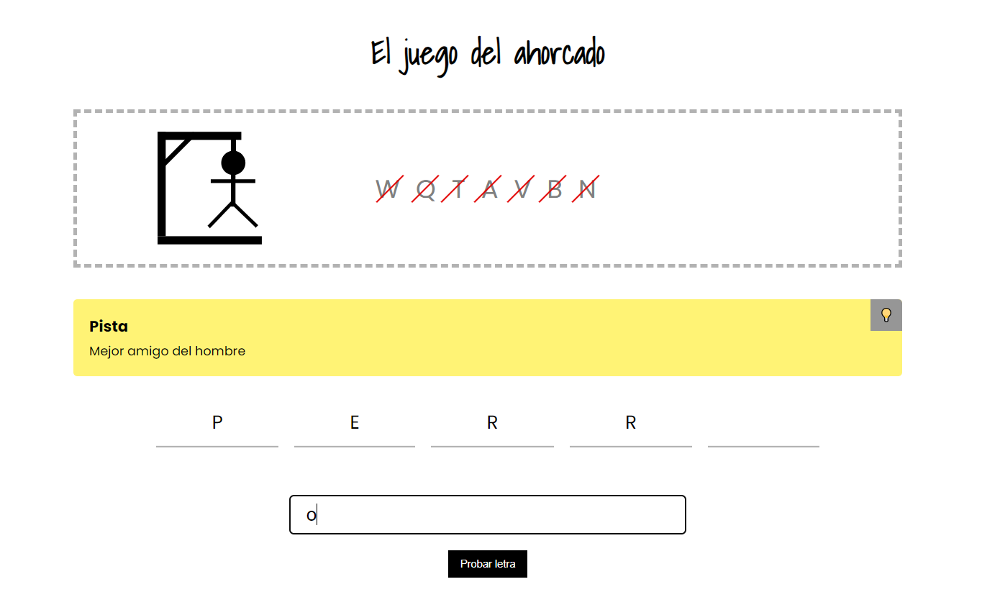

# Juego del ahorcado



<aside>
💡 **Entendiendo qué se nos pide**

</aside>

- **JUEGO DEL AHORCADO:**

  **Condiciones iniciales:**

  - Nos dan una palabra -> PERRO
  - De esa palabra, nos van a indicar el nº letras -> (5)
  - De esa palabra, no vamos a saber nada más

      _ _ _ _ _


    ---
    
    1º Ronda:
    
    ```
    jugador selecciona letra 'r'
        el sistema busca la letra 'r' en la palabra selecciona (PERRO)
            si existe la letra
                el sistema va a pintar la letra 'r' como letra correcta, en la posición                 correspondiente
                _ _ R R _
            si no existe
                el sistema desecha la letra y consume un intento del juego
    ```
    
    2º Ronda:
    
    ```
    jugador selecciona letra 'O'
        el sistema busca la letra 'O' en la palabra selecciona (PERRO)
            si existe la letra
                el sistema va a pintar la letra 'O' como letra correcta, en la posición                 correspondiente
                P E R R O
                _ _ R R O
            si no existe
                el sistema desecha la letra y consume un intento del juego
    ```
    
    posición de la letra correcta en la palabra seleccionada = la posición de la letra en la palabra oculta
    
    ---
    
    palabra: string[]= ["P", "E", "R", "R", "O"]
    
    resultado: string[]= ["", "", "", ""]


<aside>
ℹ️ **Descripción de la kata**

</aside>

---

El objetivo de esta kata es programar en Angular el juego del ahorcado.

- **Descripción del juego**

  El ahorcado (también llamado colgado) es un juego de adivinanzas de lápiz y papel para dos o más jugadores. Un jugador piensa en una palabra, frase u oración y el otro trata de adivinarla según lo que sugiere por letras o dentro de un cierto número de oportunidades.


La kata está pensada para ser realizar por equipos y se dividirá por fases. Cada fase tendrá unos requisitos a cumplir por cada uno de los equipos.

<aside>
🛠️ **Dónde realizar la kata**

</aside>

---

- Creando un nuevo proyecto de Angular.
  - Podéis utilizar este proyecto de Angular pre-configurado https://github.com/OrlandoPadron/popular-games-katas.
- Utilizando una web de despliegue rápido de un proyecto Angular
  - [https://stackblitz.com/](https://stackblitz.com/)

<aside>
🥋 **Fases de la kata**

</aside>

---

# Fase 0

**Duración:** 10 - 15 min.

**Objetivos:**

- Inicialización del proyecto en Angular.
- Estudio del algoritmo detrás de la kata con el equipo y resolución de dudas.
- Debate con el equipo sobre la estrategia que se seguirá.

# Fase 1

**Objetivos:**

Un jugador puede echarse una partida al ahorcado.

- No es necesario que la palabra sea seleccionada aleatoriamente.
- Se tiene un límite máximo de intentos en caso de añadir una letra equivocada.
- La partida acaba cuando el jugador ha acertado o ha agotado todos los intentos.
- El añadir una letra repetida no contará como intento.
- Existe una interfaz visual que indique el estado del juego al jugador. La interfaz deberá:
  - Mostrar el progreso actual de la palabra con las letras colocadas en la posición correcta.
  - Mostrar las letras falladas.

# Fase 2

**Objetivos:**

- La interfaz muestra el monigote del ahorcado que va poco a poco completándose cada vez que el jugador falla una letra. A continuación adjunto unas imágenes que pueden utilizar.

  [hangman-icons.zip](Juego%20del%20ahorcado%203aa9a4c096e24c4a95c0d1c8f2f40fcb/hangman-icons.zip)

- Las palabras ahora son elegidas aleatoriamente y son leídas a partir de un archivo JSON.
- Cada palabra viene acompañada de una breve pista que se le muestra al usuario (también estará recogida en un archivo JSON).
- El sistema solo permite la entrada de letras.

# Fase 3

**Objetivos:**

- El sistema ahora avisará al jugador con un mensaje:
  - Cuando haya introducido una letra repetida.
  - Cuando haya ganado la partida.
  - Cuando haya perdido la partida.
- Al acabar una partida, el sistema dará la opción al jugador de volver a jugar.
- El sistema ahora permitirá dos o más palabras.

# Fase 4

**Objetivos:**

- El sistema permite al jugador indicar el número de letras que tendrá la palabra seleccionada. Después el sistema buscará, de manera aleatoria, palabras que cumplan con dicha condición. En el caso de no encontrar ninguna palabra que cumpla con la condición, el sistema se lo hará saber al jugador con un mensaje.
- El sistema permite al jugador desactivar las pistas.
- El sistema permite al jugador modificar cuantos turnos cuestan sus errores.

# Fase 5

**Objetivos:**

- Refactorización del código en busca del cumplimiento de buenas prácticas.
- Resolución de bugs que hayan podido surgir en fases anteriores.
